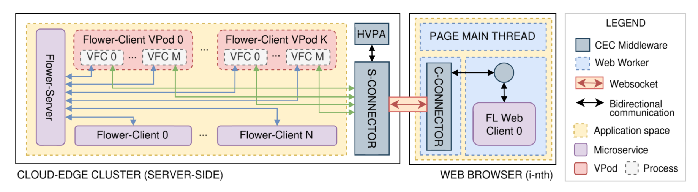
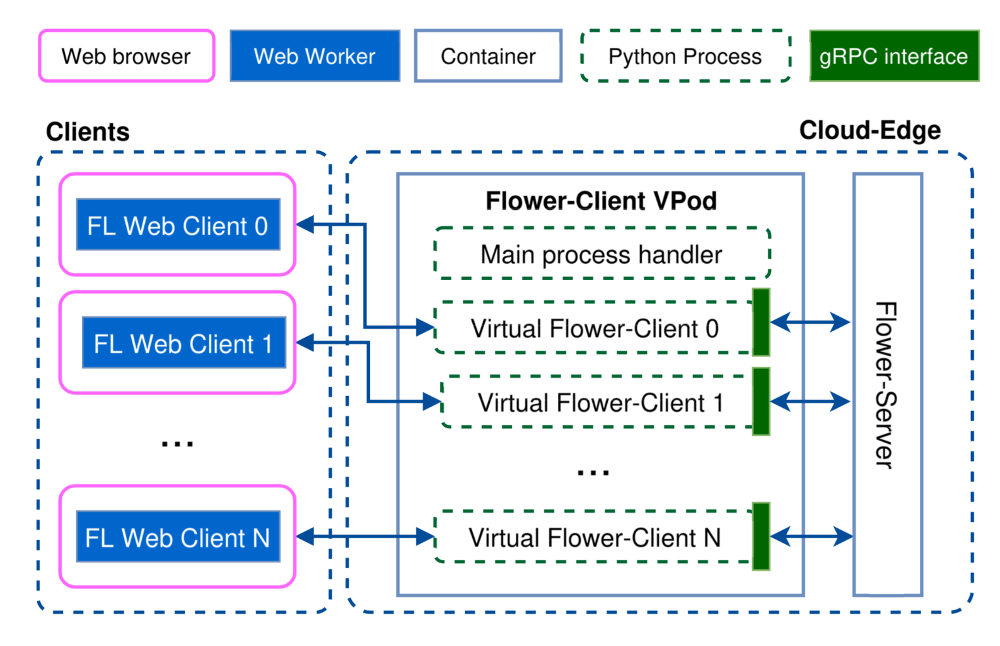
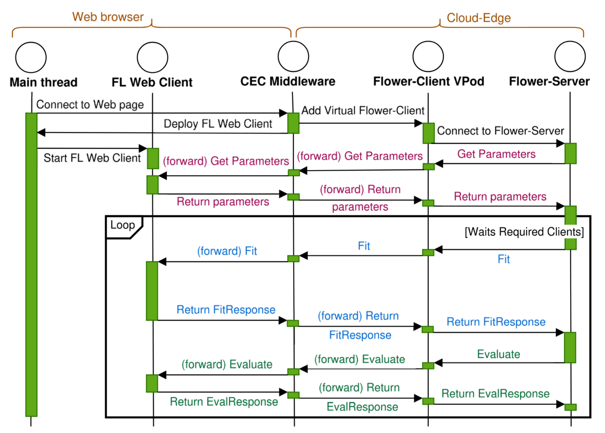

# Flower CEC (Cloud-Edge-Client Continuum)

## Publications

- **Enabling Flower for Federated Learning in Web Browsers in the Cloud-Edge-Client Continuum.**  M. Colosi, A. Catalfamo, M. Garofalo, and M. Villari. In Proceedings of the *IEEE/ACM 17th International Conference on Utility and Cloud Computing (UCC 2024)*. Proceedings will be published soon.

Related work:
- **Cloud-Edge-Client Continuum: Leveraging Browsers as Deployment Nodes with Virtual Pods.** M. Colosi, M. Garofalo, A. Galletta, M. Fazio, A. Celesti, and M. Villari. 2024. In Proceedings of the *IEEE/ACM 10th International Conference on Big Data Computing, Applications and Technologies (BDCAT '23)*. [https://doi.org/10.1145/3632366.3632395](https://doi.org/10.1145/3632366.3632395)
- **Web-Centric Federated Learning over the Cloud-Edge Continuum Leveraging ONNX and WASM.** M. Garofalo, M. Colosi, A. Catalfamo, and M. Villari. In Proceedings of  the*IEEE 29th IEEE Symposium on Computers and Communications (ISCC2024), June 26--29, 2024, Paris, France.* doi: [https://doi.org/10.1109/ISCC61673.2024.10733614](https://doi.org/10.1109/ISCC61673.2024.10733614) 
➜ [Github Repository](https://github.com/fcrlab-unime/FLAT)

## Overview

This repository implements a solution that seamlessly integrates the Flower framework with Web browsers for federated learning (FL). The system is designed to harness the computational power of heterogeneous devices (laptops, smartphones, etc.) without requiring dependency installations or manual configurations on client devices. Instead, the approach leverages a Cloud-Edge-Client Continuum architecture along with the Flower-Client Virtual Pod to transparently manage communication between the central aggregator (Flower Server) and remote Web-based FL clients.

## How It Works

### Cloud-Edge-Client Continuum

The solution adopts the Cloud-Edge-Client Continuum paradigm, which extends traditional cloud and edge computing infrastructures to include client devices as active nodes. In this architecture:
- **Cloud** handles centralized coordination and data aggregation.
- **Edge** provides localized processing near data sources.
- **Client devices** (via Web browsers) join the continuum with zero additional configuration, contributing their computational resources seamlessly.

<div align="center" style="margin-bottom: 20px">
  <figure>
    
    <figcaption><em><center>Figure 1: The architecture shows an example of a generic FL configuration using Flower to coordinate FL-clients with hybrid implementations.</center></em></figcaption>
  </figure>
</div>

This continuum approach abstracts the traditional client-server model, enabling dynamic, on-the-fly cluster formation by leveraging widely available devices.

### Flower-Client Virtual Pod

<div align="center" style="margin-bottom: 20px">
  <figure>
    
    <figcaption><em><center>Figure 2: Flower-Client Virtual Pod. A VPod can run multiple Virtual Flower-Clients, each linked with the respective FL Web Client.</center></em></figcaption>
  </figure>
</div>

A core component of this solution is the Flower-Client Virtual Pod (VPod). The VPod:
- Acts as an intermediary between the Flower Server (aggregator) and the FL Web Clients.
- Implements a Virtual Flower-Client (VFC) that communicates with the Flower Server using standard Flower methods (e.g., get_parameters, fit, evaluate).
- Manages communication through a bidirectional proxy, ensuring that training computations occur within the Web browser while the Flower Server remains unaware of the underlying client implementation.
- Allows multiple VFCs to run concurrently, facilitating scalable and heterogeneous federated learning deployments.

<div align="center" style="margin-bottom: 20px">
  <figure>
    
    <figcaption><em><center>Figure 3: Sequence Diagram. Interactions among components involving FL Web Client via the VPod Flower Client.</center></em></figcaption>
  </figure>
</div>

## Getting started

### Requirements

- **Docker & Docker Compose:** For container orchestration and deployment.
- **Make:** To build and manage project commands.

### Deployment

To get started with the repository, follow these steps:

1. **Build the Project**

   ```sh
   make build
   ```

2. **Download the required Datasets**

   ```sh
   make download-datasets
   ```

3. **Specify kleint-gateway port and IP address**:

    modify the `config.js` file replacing `<node-ip>` with the actual IP of the node hosting the kleint-gatway and port with 13579:
    <pre lang="javascript">
    const kleintGateway = "&lt;node-ip&gt;:13579";
    const scriptLoadDelay = 100; //ms
    </pre>

4. **Set Environment Variables**

   Configure the environment variables by editing the `.env` file according to your setup. The key variables are:
   
   - **FRACTION**: This variable sets the fraction of clients to be used in each federated learning round. A value of 1 indicates that all available clients will participate.
   
   - **NUM_CLIENTS**: This specifies the total number of FL clients that will participate in the federated learning process. It includes both server-side and client-side FL participants.
   
   - **NUM_ROUNDS**: This indicates the total number of federated learning rounds to be executed during the training process.
   
   - **SERVER_SIDE_CLIENTS**: This defines the number of FL clients that will be launched on the server side using the classic Flower Client implementation, typically developed in PyTorch. These server-side clients operate alongside the web-based FL clients to form a hybrid configuration.


5. **Run the Entire Architecture (CEC + Flower)**

   ```sh
   make run
   ```

6. **Stop the Flower VPods + Aggregator**

   ```sh
   make stop
   ```

7. **Remove the Entire Architecture**

   ```sh
   make remove
   ```

8. **Display Help for Available Commands**

   ```sh
   make help
   ```

## Contributions

Contributions are welcome! Please follow these guidelines when contributing to the project:

- **Fork the Repository:** Start by forking the project to your own repository.
- **Create a Branch:** Work on your feature or fix in a dedicated branch.
- **Commit Changes:** Ensure that your commits are well-documented and follow the project's coding standards.
- **Submit a Pull Request:** Once your changes are complete, submit a pull request for review.
- **Follow the Code of Conduct:** Respect the community guidelines and collaborate constructively.

For any questions or further discussions, feel free to open an issue or contact the project maintainers.
